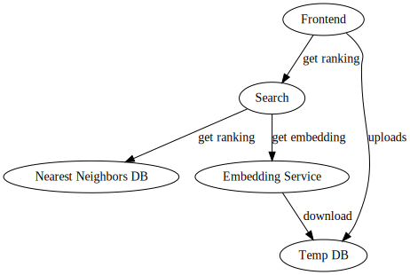

# AudioSearch

An audio search engine based off comparing embeddings computed with contrastive learning methods. See [this old writeup](https://benblack769.github.io/posts/projects/sound-eval/) if you are curious about the details.

AudioSearch is built on a microservice based architecture. There are three core services and a helper service. The Embedding service is a pure compute service that takes in an mp3 audio url and returns its embedding (computed with pretrained weights). The nearest neighbors database is a specialized database service that takes in an embedding and finds the closest entries in the database. Finally, the search service uses the other two services, taking in multiple audio files and finding the nearest result to the center of the group of files. Allowing multiple files for search potentially increases the fidelity of the search, allowing the user to find obscure results with greater reliability.

Finally, a helper database, temp_db, is useful in hosting the uploaded mp3 file so that the other services can download it.

The following diagram summarizes the high level interactions between the services




## Embedding Service

The embedding service performs expensive file processing to turn an audio file in an mp3 format into an embedding useful for search.

Since its goal is to take the compute burden off of the search service, its input is a url, not the whole file contents.

### API

#### /embedding (get request)

Input:

```
{
    "url": <url string for audio file>
}
```

Response on success:

```
{    
    "type": "SUCCESS",
    "embedding": <embedding vector, encoded as a hex64 encoded byte array> ,
    "size": <integer length of embedding vector>,
}
```

Failure modes:

* `"FORMAT_ERROR"`: Input badly formatted. Body of request is not valid json or does not have correct keys.
* `"URL_ERROR"`: Url does not resolve to a file.


## Nearest Neighbors DB

Most databases are keyed on discrete values, and return exact matches. In the nearest neighbors DB, the key is a continuous value in a high dimentional space (dozens to hundreds of dimensions), given some comparator metric.

In fuzzy search algorithms like the one used here for audio retrieval, the key is a soft hash of the file, meaning a vector where nearby vectors are similar. So the key nearest neighbors DB is obviously useful.

The problem with this database is that there is no general way of doing better than linear search through all the keys, due to the curse of dimensionality, and the lack of good properties of popular comparison metrics such as cosine distance.
This means that in the long term, horizontal scaling, perhaps across GPUs, will be needed to maintain performance of the database as the number of entries and requests grow.

Currently only get requests are supported. In the future, post requests to update the database will also be supported.

### API

#### /ranking (get request)

Input:

```
{
    "query": <query vector, encoded as a hex64 encoded byte array>,
    "comparator": <comparison name, options include `cosine`, `inner`, `euclidian`,
    "start_rank": <first rank to return (allows for paging)>,
    "end_rank": <past the last rank to return (allows for paging)>,
}
```

Response on success:

```
{
    "type": "SUCCESS",
    "values": [
        <`start_rank`th best value>,
        <`start_rank + 1`th best value>,
        ...
        <`end_rank - 1`th best value>,
    ],
}
```

Failure modes: FORMAT_ERROR


#### /get_dataset_size (get request)

Input: None

Response on success:

```
{
    "type": "SUCCESS",
    "size": <number of keys in database>,
}
```

#### /add_embeddings (post request)

NOT YET IMPLETMENTED!


Input:

```
{
    "keys": <key vectors, encoded as a hex64 encoded byte array>,
    "num_keys": <number of keys. 1 if batched request is not needed>,
    "values": [<value_1>,<value_2>,...,<value_{num_keys-1}>] <all values must be properly formatted json data>,
}
```

## Search service

The search API is a light wrapper over the previous two APIs which provides a reasonable search interface for a frontend.

Note that unusually, instead of just taking in a single file as a search, this API takes in multiple files, as well as use defined weights, and performs a weighted averaging over the query vector to create the embedding.

### API

#### /submit (get request)

Input:

```
{
    "urls": [<url1>,<url2>,...,<urln>],
    "weights": [<weight1>,<weight2>,...,<weightn>] <weight must be scalar type>,
    "start_rank": <first rank to return (allows for paging)>,
    "end_rank": <past the last rank to return (allows for paging)>,
    "comparator": <comparison name, options include `cosine`, `inner`, `euclidian`,
}
```

Response on success:

```
{
    "type": "SUCCESS",
    "values": [
        <`start_rank`th best value>,
        <`start_rank + 1`th best value>,
        ...
        <`end_rank - 1`th best value>,
    ],
}
```

Assumptions:

* URLs and weights must be of same length
* URLs must point to valid mp3 files
* Values in nearest neighbor DB must all be json data that contain a `url` field that points to the location of a mp3 file.

## Temp DB

This service provides a convenient location for a frontend to upload mp3 files so that the embedding DB can access those files. Files are deleted if they are more than 1 hour old.

### API

#### /upload (post request)

Input:

Takes in a file via the typical http protocol.

File must be under 20MB

Response:

```
{
    "type": "SUCCESS",
    "id": <unique file ID, required to download file>
}
```

#### /download/<file_id> (get request)

Gets the file associated with file_id.

## Testing

All four services have an integration test in the `integration_test` folder which makes simple calls to their REST API and checks the response. Run `bash integration_test_all.sh` to run all the integration tests.

The embedding service, nearest_neighbors_db, and temp db have unit tests which cover some of the more complex logic of their implementation. Run `bash unittest_all.sh` to run all the unit tests.

## Future plans

This current API is meant to be extended to a much more rich and powerful search engine where a web crawler continuously updates the nearest neighbors DB and occasionally initiates complete retraining of the embedding model. Note that in order to support this new architecture, very little needs to change -- there are no new dependencies needed.


